# АНАЛИЗ ДАННЫХ И ИСКУССТВЕННЫЙ ИНТЕЛЛЕКТ [in GameDev]
Отчет по лабораторной работе #1 выполнил(а):
- Биккужина Полина Дмитриевна
- РИ210941
Отметка о выполнении заданий (заполняется студентом):

| Задание | Выполнение | Баллы |
| ------ |------------| ------ |
| Задание 1 | *          | 60 |
| Задание 2 | *          | 20 |
| Задание 3 | *          | 20 |

знак "*" - задание выполнено; знак "#" - задание не выполнено;

Работу проверили:
- к.т.н., доцент Денисов Д.В.
- к.э.н., доцент Панов М.А.
- ст. преп., Фадеев В.О.

Структура отчета

- Данные о работе: название работы, фио, группа, выполненные задания.
- Цель работы.
- Задание 1.
- Код реализации выполнения задания. Визуализация результатов выполнения (если применимо).
- Задание 2.
- Код реализации выполнения задания. Визуализация результатов выполнения (если применимо).
- Задание 3.
- Код реализации выполнения задания. Визуализация результатов выполнения (если применимо).
- Выводы.
- ✨Magic ✨

## Цель работы
Ознакомиться с основными операторами зыка Python на примере реализации линейной регрессии.

## Задание 1
### Написать программы Hello World на Python и Unity
#### Скриншоты из Google.Colab


#### Скриншоты из Unity
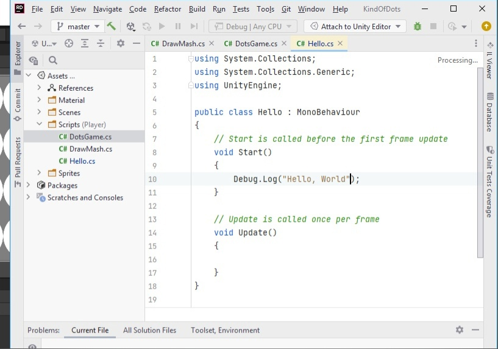
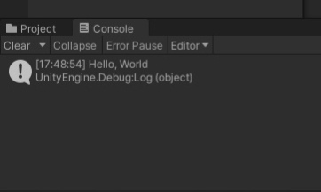


## Задание 2
### В разделе "ход работы" пошагово выполнить каждый пункт с описанием и примером реализации задачи по теме лабароторной работы.
#### Подготовка данных:
```py
In [ ]:
#Import the required modules, numpy for calculation, and Matplotlib for drawing
import numpy as np
import matplotlib.pyplot as plt
#This code is for jupyter Notebook only
%matplotlib inline

# define data, and change list to array
x = [3,21,22,34,54,34,55,67,89,99]
x = np.array(x)
y = [2,22,24,65,79,82,55,130,150,199]
y = np.array(y)

#Show the effect of a scatter plot
plt.scatter(x,y)
```
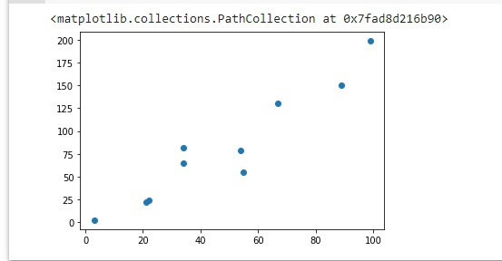
#### Определение всвязные функции:
* model() - функция определения модели линейной регрессии
* lose_function() - функция потерь среднеквадратичной ошибки
* optimize() - функция гадиентного спуска для нахождения частных производных
* iterate() - функция-итератор для задоного количества значений

```py
In [ ]:
#The basic linear regression model is wx+ b, and since this is a two-dimensional space, the model is ax+ b
def model(a, b, x):
    return a*x + b
    
#Tahe most commonly used loss function of linear regression model is the loss function of mean variance difference
def loss_function(a, b, x, y):
    num = len(x)
    prediction=model(a,b,x)
    return (0.5/num) * (np.square(prediction-y)).sum()
    
#The optimization function mainly USES partial derivatives to update two parameters a and b
def optimize(a,b,x,y):
    num = len(x)
    prediction = model(a,b,x)
    #Update the values of A and B by finding the partial derivatives of the loss function on a and b
    da = (1.0/num) * ((prediction -y)*x).sum()
    db = (1.0/num) * ((prediction -y).sum())
    a = a - Lr*da
    b = b - Lr*db
    return a, b

#iterated function, return a and b
def iterate(a,b,x,y,times):
    for i in range(times):
    a,b = optimize(a,b,x,y)
    return a,b
```
#### Инициализация объектов и визуализация данных первой итерации:
```py
In [ ]:
#Initialize parameters and display
a = np.random.rand(1)
print(a)
b = np.random.rand(1)
print(b)

Lr = 0.000001

#For the first iteration, the parameter values, losses, and visualization after the iteration are displayed
a,b = iterate(a,b,x,y,1)
prediction=model(a,b,x)
loss = loss_function(a, b, x, y)
print(a,b,loss)
plt.scatter(x,y)
plt.plot(x,prediction)
```
#### Результаты первой итерации:
[0.08183542]
[0.87649108]
[0.08704118] [0.87656709] 4479.971536742217
[<matplotlib.lines.Line2D at 0x7fad8611d550>]
```py
a,b = iterate(a,b,x,y,1)
```
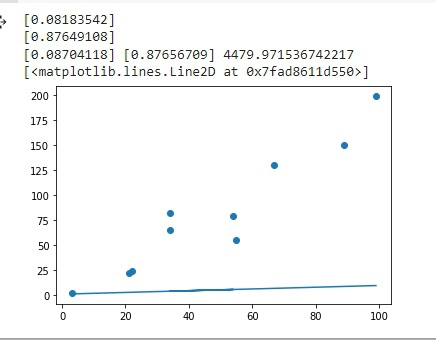
#### Вторая итерация:
[0.16533065]
[0.48050683]
[0.17524012] [0.48065143] 4062.888507308293
[<matplotlib.lines.Line2D at 0x7fad86094190>]
```py
a,b = iterate(a,b,x,y,2)
```
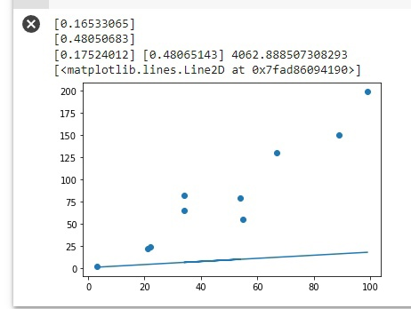
#### Третья итерация:
[0.94623132]
[0.51592021]
[0.95373459] [0.51602501] 1174.0319250021817
[<matplotlib.lines.Line2D at 0x7fad8655af90>]
```py
a,b = iterate(a,b,x,y,3)
```
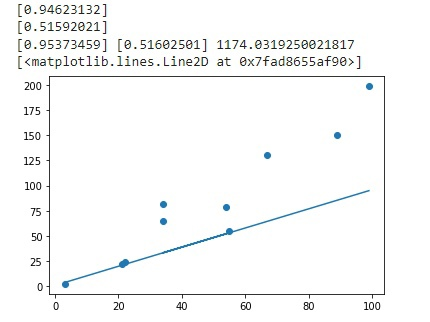
#### Четвертая итерация:
[0.76534723]
[0.54673834]
[0.77759111] [0.54691214] 1659.1959078203301
[<matplotlib.lines.Line2D at 0x7fad8633c450>]
```py
a,b = iterate(a,b,x,y,4)
```
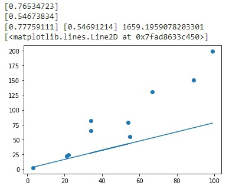
#### Пятая итерация:
[0.82334478]
[0.65606947]
[0.83769487] [0.65627203] 1477.9418599356488
[<matplotlib.lines.Line2D at 0x7fad85f30c50>]
```py
a,b = iterate(a,b,x,y,5)
```
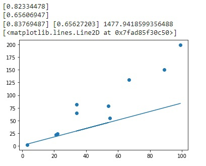
#### 1000-я итерация:
[0.5099423]
[0.57830139]
[1.6909869] [0.59311942] 195.0163788436338
[<matplotlib.lines.Line2D at 0x7fad85eb3090>]
```py
a,b = iterate(a,b,x,y,1000)
```
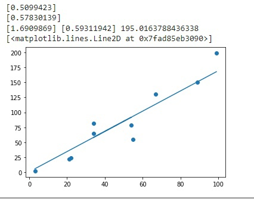
## Задание 3
### Должна ли величина loss стремиться к нулю при изменении исходных
Ответ: Да, величиная loss показывает потери при выполнении линейной регрессии. То есть то, 
насколько эффективен метод model() при данных параметрах в качестве модели линейной регрессии. 
При увеличении количества итераций(times в методе iterate) модель становится более эффективной,
поэтому параметр loss будет уменьшаться и приближаться к 0.
#### При times = 1, loss = 4479.971536742217
```py
a,b = iterate(a,b,x,y,1)
```


#### При times = 5, loss = 1477.9418599356488
```py
a,b = iterate(a,b,x,y,5)
```


#### При times = 30000, loss = 188.67480600721188
```py
a,b = iterate(a,b,x,y,30000)
```
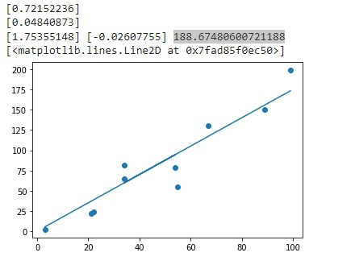


### Какова роль параметра Lr? Ответьте на вопрос, приведите пример выполнения кода, который подтверждает ваш ответ. В качестве эксперимента можете изменить значение параметра.
Ответ: Lr - парамерт, регулирующий скорость обучения модели с каждой итерацией. 
Чем больше Lr, тем быстрее уменьшается lose.

#### При Lr = 0.000001
##### Первая итерация:
[0.08183542]
[0.87649108]
[0.08704118] [0.87656709] 4479.971536742217

#### Пятая итерация:
[0.82334478]
[0.65606947]
[0.83769487] [0.65627203] 1477.9418599356488

#### При Lr = 0.0001
##### Первая итерация:
[0.45002876]
[0.56698607]
[0.85647853] [0.57285823] 1428.3667748081343

#### Пятая итерация:
[0.77011916]
[0.5569795]
[1.59650738] [0.56798294] 224.89561245401
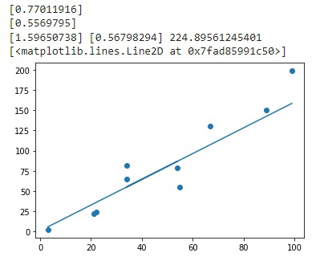
## Выводы
В ходе работы я ознакомилась с алгоритмом линейной регрессии. 
Можно утверждать, что точность данного алгоритма зависит от количества итераций и параметра Lr.
#### ✨✨✨