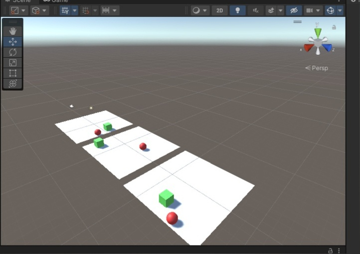
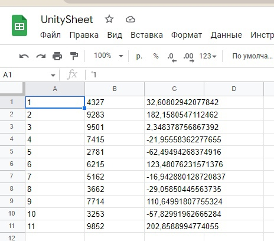
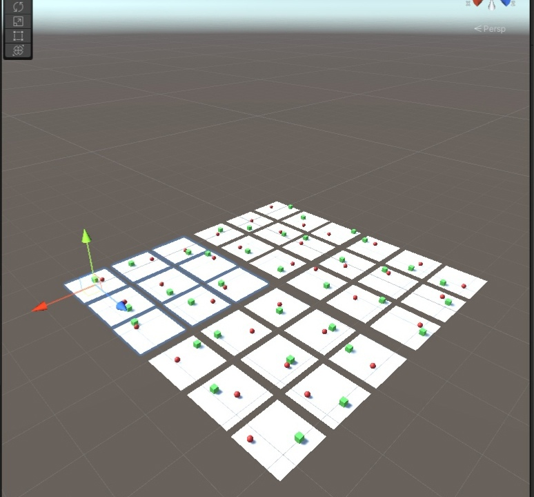
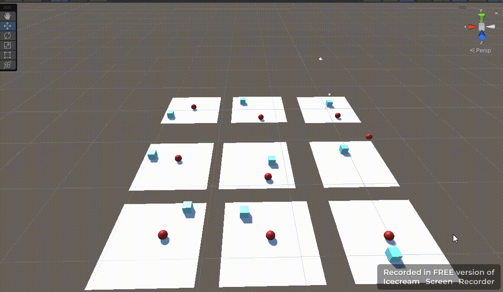
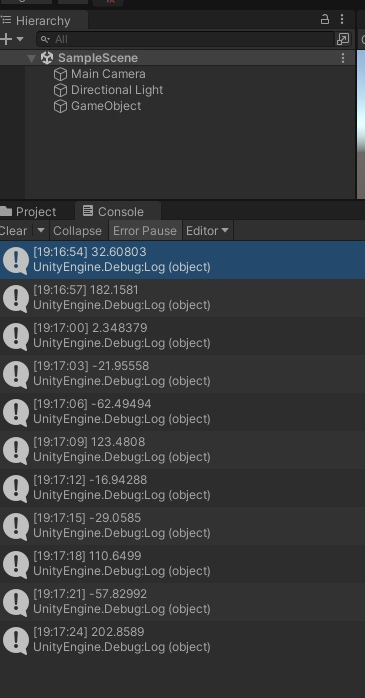
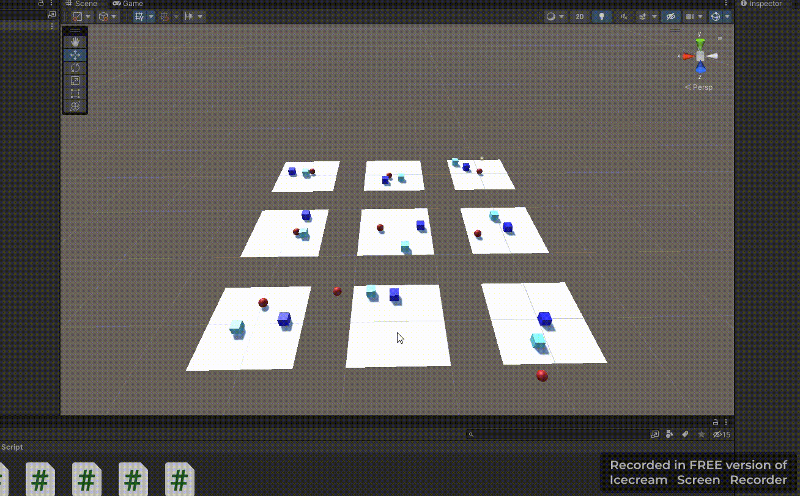

# АНАЛИЗ ДАННЫХ И ИСКУССТВЕННЫЙ ИНТЕЛЛЕКТ [in GameDev]
Отчет по лабораторной работе #3 выполнил(а):
- Биккужина Полина Дмитриевна
- РИ210941
Отметка о выполнении заданий (заполняется студентом):

| Задание | Выполнение | Баллы |
| ------ |------------| ------ |
| Задание 1 | *          | 60 |
| Задание 2 | *          | 20 |
| Задание 3 | *          | 20 |

знак "*" - задание выполнено; знак "#" - задание не выполнено;

Работу проверили:
- к.т.н., доцент Денисов Д.В.
- к.э.н., доцент Панов М.А.
- ст. преп., Фадеев В.О.

Структура отчета

- Данные о работе: название работы, фио, группа, выполненные задания.
- Цель работы.
- Задание 1.
- Код реализации выполнения задания. Визуализация результатов выполнения (если применимо).
- Задание 2.
- Код реализации выполнения задания. Визуализация результатов выполнения (если применимо).
- Задание 3.
- Код реализации выполнения задания. Визуализация результатов выполнения (если применимо).
- Выводы.
- ✨Magic ✨

## Цель работы
Познакомиться с программными средствами для организции
передачи данных между инструментами google, Python и Unity


## Задание 1

### Реализовать совместную работу и передачу данных в связке Python - Google-Sheets – Unity.
 Создала модель "Плоскость-Сфера-Куб", установила все необходимые пакеты в Unity и Anaconda. 
 Далее создала скрипт для шара, проект в MlAgent и начала тестировать.

#### Изначально 3 копии модели:


#### Затем 9 копий:


#### 36 копии модели:



### Вывод консоли Anaconda

Понятно, что с ростом числа попыток изменяются и некоторые параметры вывода

_Mean Reward_ - стремится к 1

_Std of reward_ - стремится в 0

Можно сделать вывод что _Mean Reward_ и _Std of reward_ - это параметры успешности обучения.

#### Результат обучения
Шар научился находить путь до куба.


## Задание 2
### Подробно описать каждую строку файла конфигурации нейронной сети. Найти информацию о компонентах Decision Requester, Behavior Parameters.
```
behaviors:
  RollerBall:                        #Имя агента
    trainer_type: ppo                #Режим обучения (Proximal Policy Optimization).
    hyperparameters:                 #Гиперпараметры.
      batch_size: 10                 #Количество опытов на каждой итерации для обновления экстремумов функции.
      buffer_size: 100               #Количество опыта, которое нужно набрать перед обновлением модели.
      learning_rate: 3.0e-4          #Устанавливает шаг обучения (начальная скорость).
      beta: 5.0e-4                   #Отвечает за случайность действия, повышая разнообразие и иследованность пространства обучения.
      epsilon: 0.2                   #Порог расхождений между старой и новой политиками при обновлении.
      lambd: 0.99                    #Определяет авторитетность оценок значений во времени. Чем выше значение, тем более авторитетен набор предыдущих оценок.
      num_epoch: 3                   #Количество проходов через буфер опыта, при выполнении оптимизации.
      learning_rate_schedule: linear #Определяет, как скорость обучения изменяется с течением времени, линейно уменьшает скорость.
    network_settings:                #Определяет сетевые настройки.
      normalize: false               #Отключается нормализация входных данных.
      hidden_units: 128              #Количество нейронов в скрытых слоях сети.
      num_layers: 2                  #Количество скрытых слоев для размещения нейронов.
    reward_signals:                  #Задает сигналы о вознаграждении.
      extrinsic:
        gamma: 0.99                  #Коэффициент скидки для будущих вознаграждений.
        strength: 1.0                #Шаг для learning_rate.
    max_steps: 500000                #Общее количество шагов, которые должны быть выполнены в среде до завершения обучения.
    time_horizon: 64                 #Количество циклов ML агента, хранящихся в буфере до ввода в модель.
    summary_freq: 10000              #Количество опыта, который необходимо собрать перед созданием и отображением статистики.

```
* **_Decision Requester_** - запрашивает решение через регулярные промежутки времени и обрабатывает чередование между ними во время обучения.

* **_Behavior Parameters_** - определяет принятие объектом решений, в него указывается какой тип поведения будет использоваться: уже обученная модель или удалённый процесс обучения.

## Задание 3
### Доработать сцену и обучить ML-Agent таким образом, чтобы шар перемещался между двумя кубами разного цвета.
#### Добавила еще куб, создала вариант префаба

#### Создала скрипт обучения сферы проходить между кубов 
```csharp
using System.Collections;
using System.Collections.Generic;
using UnityEngine;
using Unity.MLAgents;
using Unity.MLAgents.Sensors;
using Unity.MLAgents.Actuators;

public class RollerAgent : Agent
{
    private Rigidbody rBody;
    // Start is called before the first frame update
    void Start()
    {
        rBody = GetComponent<Rigidbody>();
    }

    public Transform Target1;
    public Transform Target2;

    public override void OnEpisodeBegin()
    {
        if (transform.localPosition.y < 0)
        {
            rBody.angularVelocity = Vector3.zero;
            rBody.velocity = Vector3.zero;
            transform.localPosition = new Vector3(0, 0.5f, 0);
        }

        Target1.localPosition = new Vector3(Random.value * 8 - 4, 0.5f, Random.value * 8 - 4);
        do
        {
            Target2.localPosition = new Vector3(Random.value * 8 - 4, 0.5f, Random.value * 8 - 4);
        } while (Vector3.Distance(Target1.localPosition, Target2.localPosition) <= 2.3f);
    }

    public override void CollectObservations(VectorSensor sensor)
    {
        sensor.AddObservation(Target1.localPosition);
        sensor.AddObservation(Target2.localPosition);
        sensor.AddObservation(transform.localPosition);
        sensor.AddObservation(rBody.velocity.x);
        sensor.AddObservation(rBody.velocity.z);
    }

    public float forceMultiPlayer = 10;

    public override void OnActionReceived(ActionBuffers actions)
    {
        Vector3 controlSignal = Vector3.zero;
        controlSignal.x = actions.ContinuousActions[0];
        controlSignal.z = actions.ContinuousActions[1];
        rBody.AddForce(controlSignal * forceMultiPlayer);

        float distanceToTarget1 = Vector3.Distance(transform.localPosition, Target1.localPosition);
        float distanceToTarget2 = Vector3.Distance(transform.localPosition, Target2.localPosition);
        float distanceToTargets= Vector3.Distance(Target1.localPosition, Target2.localPosition);
        
        if (distanceToTarget1 + distanceToTarget2 <= distanceToTargets+0.3f)
        {
            SetReward(1.0f);
            EndEpisode();
        } else if (transform.localPosition.y < 0)
        {
            EndEpisode();
        }
    }
}
```
#### Результат обучения


Пока модель обучилась не до конца. Шар очень часто заносить. 
Но уже можно увидеть результат обучения.


## Выводы
Данный метод обучения может помочь мне в различных игровых проектах для создания _AI персонажей, генерации случайных последовательностей и др_.

Не смотря на интересность данного подхода, он всё же достаточно неудобный из-за технических проблем с Anaconda.
#### ✨✨✨