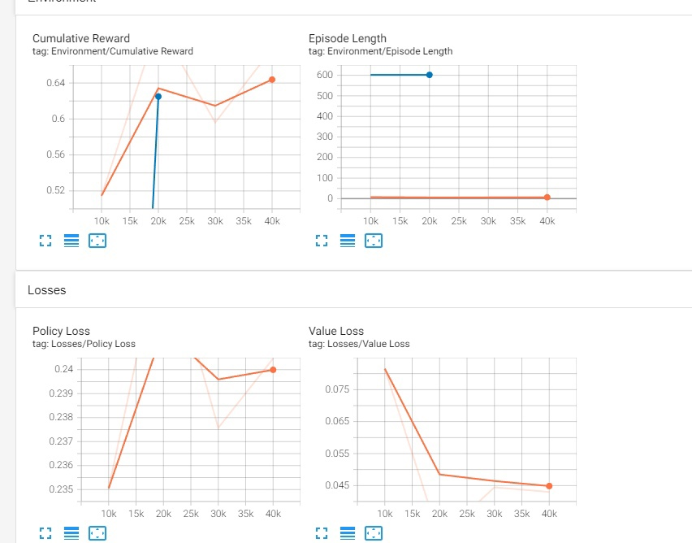

# АНАЛИЗ ДАННЫХ И ИСКУССТВЕННЫЙ ИНТЕЛЛЕКТ [in GameDev]
Отчет по лабораторной работе #4 выполнил(а):
- Биккужина Полина Дмитриевна
- РИ-210941
Отметка о выполнении заданий (заполняется студентом):

| Задание | Выполнение | Баллы |
| ------ |------------| ------ |
| Задание 1 | *          | 60 |
| Задание 2 | *          | 20 |
| Задание 3 | *          | 20 |

знак "*" - задание выполнено; знак "#" - задание не выполнено;

Работу проверили:
- к.т.н., доцент Денисов Д.В.
- к.э.н., доцент Панов М.А.
- ст. преп., Фадеев В.О.

Структура отчета

- Данные о работе: название работы, фио, группа, выполненные задания.
- Цель работы.
- Задание 1.
- Код реализации выполнения задания. Визуализация результатов выполнения (если применимо).
- Задание 2.
- Код реализации выполнения задания. Визуализация результатов выполнения (если применимо).
- Задание 3.
- Код реализации выполнения задания. Визуализация результатов выполнения (если применимо).
- Выводы.
- ✨Magic ✨

## Задание 1

### В проекте Unity реализовать перцептрон, который умеет производить вычисление бинарных операций.

Я скачала скрипт из готовых материалов к лабораторной, 
поместила его на сцену, на пустой объект Perceptron и последовательно записала туда нужные значения из таблицы истинности для операций **_OR, AND, NAND, XOR_**.

#### Аргументы для операции OR:

#### Результат обучения для операции OR:

#### Аргументы для операции AND:

#### Результат обучения для операции AND:

#### Аргументы для операции NAND:

#### Результат обучения для операции NAND:

#### Аргументы для операции XOR:

#### Результат обучения для операции XOR:

Как видно из результатов обучения все операции кроме XOR были успешно обработаны Перцептроном. 
Это можно объяснить проблемой, описанной на лекции.

Перцептрон обрабатывает только линейные функции.

Сколько бы ни было эпох обучения, Перцептрон не может обработать эту операцию корректно

## Задание 2

### Построить графики зависимости количества эпох от ошибки обучения:
Я построила при помощи таблиц Google графики зависимости.

## Задание 3

### Создать визуальную работу модели перцептрона на сцене Unity
Поменяла скрипт Perceptron.cs, использовала OnCollisionEnter() и AddForce()
для визуализации обученного перцептрона. 

#### При выводе единицы кубики отталкиваются. 
Зеленый - единица, красный - нуль.

## Выводы
Данная модель перцептрона реализует базовую логику обучения, но для сложных нелинейных операций перцептрон не подходит.

#### ✨✨✨