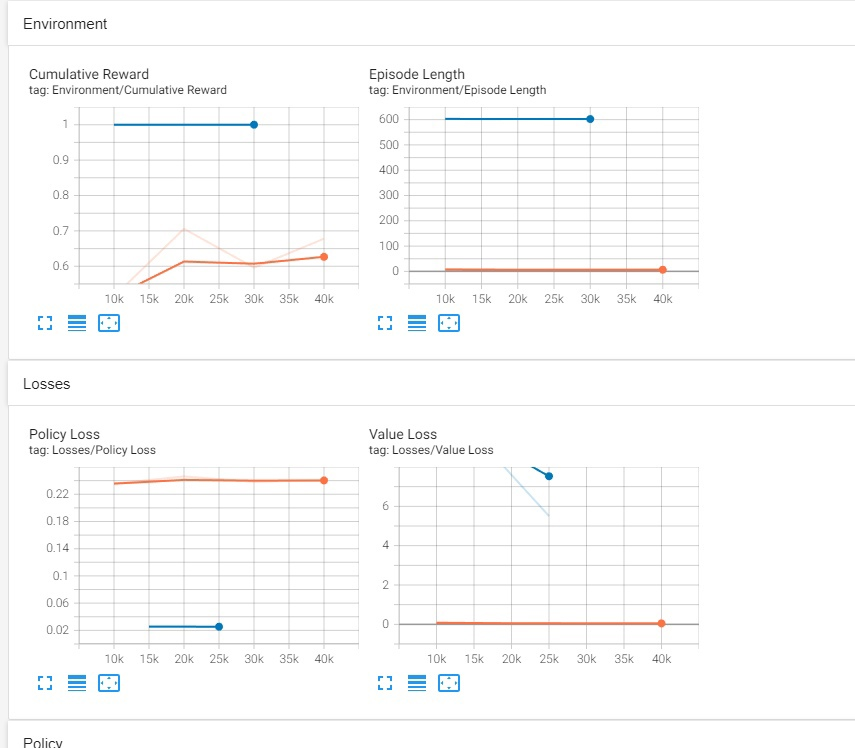
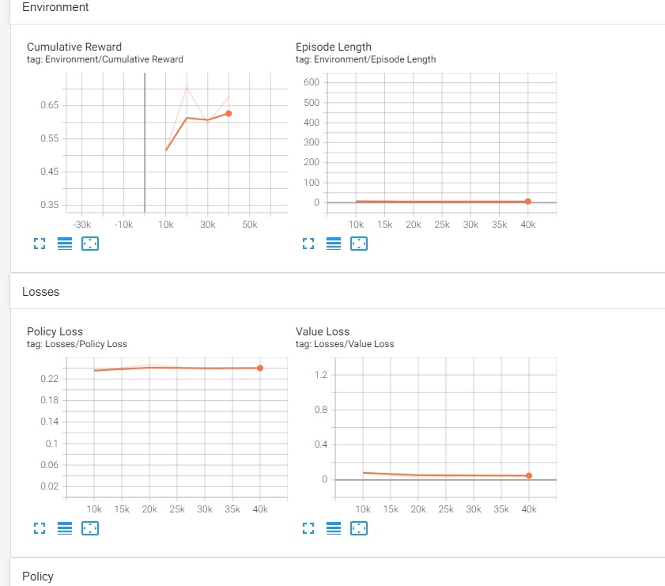

# АНАЛИЗ ДАННЫХ И ИСКУССТВЕННЫЙ ИНТЕЛЛЕКТ [in GameDev]
Отчет по лабораторной работе #5 выполнил(а):
- Биккужина Полина Дмитриевна
- РИ-210941
Отметка о выполнении заданий (заполняется студентом):

| Задание | Выполнение | Баллы |
| ------ |------------| ------ |
| Задание 1 | *          | 60 |
| Задание 2 | *          | 20 |
| Задание 3 | *          | 20 |

знак "*" - задание выполнено; знак "#" - задание не выполнено;

Работу проверили:
- к.т.н., доцент Денисов Д.В.
- к.э.н., доцент Панов М.А.
- ст. преп., Фадеев В.О.

Структура отчета

- Данные о работе: название работы, фио, группа, выполненные задания.
- Цель работы.
- Задание 1.
- Код реализации выполнения задания. Визуализация результатов выполнения (если применимо).
- Задание 2.
- Код реализации выполнения задания. Визуализация результатов выполнения (если применимо).
- Задание 3.
- Код реализации выполнения задания. Визуализация результатов выполнения (если применимо).
- Выводы.
- ✨Magic ✨

## Задание 1

### Измените параметры файла. yaml-агента и определить какие параметры и как влияют на обучение модели.
Для начала я обучила MLAgent и отобразила результат в TensorBoard.

#### Стартовые графики:

Почитав описание параметров yaml-файла по [ссылке](https://github.com/Unity-Technologies/ml-agents/blob/main/docs/Training-Configuration-File.md).

Я выяснила, что обозначают все парамерты в моём файле и можно предположить как поведет себя процесс обучения при изменении них.

###
#### strength
Я поменяла **strength** с 1.0 на 10.0

Изменила **strength** с 1.0 на 0.5

Параметр **strength** влияет на скорость обучения, поэтому графики с меньшим strength идут вниз, а с большим - вверх.

###
#### beta
Поменяла **beta** с e-2 на e-1. График стал более прямым.

С e-2 на e-4

Параметр **beta** отвечает за энтропию, поэтому графики с меньшим **beta** имеют большую энтропию следовательно более изменчивые.

###
#### num_layer
Изменила **num_layer** c 2 на 3

Изменение количества слоёв обучения ведет к более продуктивной работе MLAgent
## Задание 2

### Опишите результаты, выведенные в TensorBoard. 
Теперь проанализируем выведенные графики в TensorBoard.

Здесь представленны два объекта для анализа: обученный RollerBall - его графики статичны, и Economic - с ним мы как раз и работали.

На первой вкладке TensorBoard расположены графики всех [скалярных велечин](https://medium.com/aureliantactics/understanding-ppo-plots-in-tensorboard-cbc3199b9ba2), которые нам необходимы

_**Cumulative Reward**_ - накопленное вознаграждение. 

_**Policy Loss**_ - насколько сильно меняется политика (процесс принятия решений) во время обучения.

_**Value Loss**_ - средняя потеря обновления функции значения. Коррелирует с тем, насколько хорошо модель способна предсказать значение каждого состояния.

В стартовом графике Cumulative Reward для Economic не такой какой необходим, т.к. награда должна увеличиваться по мере увеличения шагов.

Также и с Entopy, у Economic она стабильно высокая, хотя должна постепенно уменьшаться.

Из этого следует, что изначальные параметры обучения не особо эффективны. 

Если немного поменять параметры в yaml-файле, то результаты слегка улучшатся.

## Выводы
В этой работе я научилась работать с TensorBoard и применять ее для тестирования эффективности обучения MLAgent'а.

При первом взгляде на интерфейс TensorBoard было интуитивно не понятно, что за что отвечает. 
Но при изучении его поведения и изменении параметров yaml-файла данный инструмент показался очень удобным и функциональным для анализа обучаемой модели.
 
#### ✨✨✨